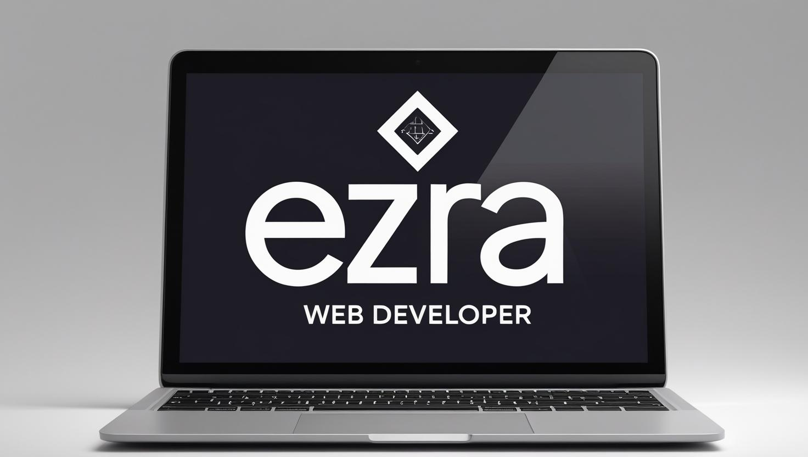

 Here's a complete `README.md` file tailored for your **HTML + CSS personal portfolio project**, based on the code you shared:

---

 `README.md`

```markdown
 My Portfolio Website

This is a personal portfolio website created using HTML and CSS. It showcases a professional profile including skills, education, interests, and projects. The design includes a modern navigation bar, animated bars for visual interest, and responsive layout elements.

## 🌐 Live Preview

*(Optional: Add GitHub Pages link or Netlify/Render/Surge deploy link here if hosted)*

## 🛠️ Technologies Used

- **HTML5**: Structure and layout
- **CSS3**: Styling and animations
- *(JavaScript can be added later for interactivity)*

 Project Structure

```

project-root/
├── index.html          # Main landing page
├── style.css           # CSS for styling and animations
├── images/
│   └── logo.jpg        # Logo image used in navbar
├── skills.html         # Skills section
├── education.html      # Educational background
├── interests.html      # Personal interests
├── projects.html       # Project portfolio
└── contact.html        # Contact form or info

````

 Features

- 🔷 Animated vertical bars for a dynamic background
- 🔷 Fixed header with responsive navigation bar
- 🔷 Multiple pages with consistent design (About, Skills, Education, etc.)
- 🔷 Semantic HTML structure for accessibility
- 🔷 Lightweight and easy to extend

 Sample Code Overview

### HTML: `index.html`
```html
<header class="header">
  <nav class="navbar">
    <a href="#"></a>
    <ul class="topnav">
      <li class="active"><a href="index.html">About</a></li>
      <li><a href="skills.html">Skills</a></li>
      <li><a href="education.html">Education</a></li>
      <li><a href="interests.html">Interests</a></li>
      <li><a href="projects.html">Projects</a></li>
      <li class="right"><a href="contact.html">Contact</a></li>
    </ul>
  </nav>
</header>
````
 CSS Animation (in `style.css`)

```css
.bars-animation .bar {
  animation: grow 1s ease-in-out infinite;
  animation-delay: calc(var(--i) * 0.1s);
}
```

 About the Developer

Hi! I'm **Ezra Langat**, an aspiring web developer with a strong foundation in front-end technologies and a passion for crafting responsive and user-friendly websites.

 How to Use

1. Clone the repository:

   ```bash
   git clone https://github.com/yourusername/your-portfolio.git
   ```
2. Open `index.html` in your browser.
3. Customize the content (text, images, links) as needed.


---

Feel free to fork and customize this portfolio to match your personal brand!

```

---

Would you like me to generate this as a downloadable `README.md` file as well?
```

